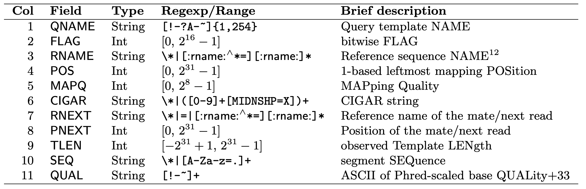

#  File Formats

###### ================================================================================
###### OVERVIEW
+ 1. [ POD5 ](#pod5)
+ 2. [ uBAM ](#ubam)
+ 3. [ FASTA ](#fasta)
+ 4. [ FASTQ ](#fastq)
+ 5. [ PEP ](#pep)
+ 6. [ GTF ](#gtf)
###### ================================================================================

## 1. [pod5](https://pod5-file-format.readthedocs.io/en/latest/)
POD5 is a file format developed by Oxford Nanopore (ONT) to store raw nanopore sequencing data. Data is stored using Apache Arrow. 
In this project pod5 files are the direct ouput from ONT sequecing runs and are used as input for basecalling to generate unaligned BAM (uBAM) files.

## 2. [uBAM](https://gatk.broadinstitute.org/hc/en-us/articles/360035532132-uBAM-Unmapped-BAM-Format)
A uBAM (unmapped BAM) file is a BAM file with the exception of any alignment information.

### 2.1 [BAM](https://samtools.github.io/hts-specs/SAMv1.pdf)
The BAM (Binary Alignment/Map) format is the compressed binary version of the SAM file.

### 2.1 [SAM](https://samtools.github.io/hts-specs/SAMv1.pdf)
The SAM (Sequence Alignment/Map format) file is a TAB-delimted text format consiting of an optional header ('@') and alignment section. Each alignment section has 11 mandatory fields:

## 3. [FASTA](https://rnnh.github.io/bioinfo-notebook/docs/file_formats.html)
The fasta file format is a text based file used to present nucleotide or protein seqeunces. Each seqeuence begins with a header line starting with '>' followed by an optional description, and one or more lines containing the sequence itself. 

## 4. [FASTQ](https://rnnh.github.io/bioinfo-notebook/docs/file_formats.html)
The FASTQ format extends FASTA by including quality scores for each seqeunce. Each entry consists of four lines: 
- a header (@), 
- the sequence, 
- a separator line (+), 
- and a quality score line matching the sequence length.

## 5. [PEP](https://pep.databio.org/)
In short PEP (Portable Excapsuled Projects) is a file format which aims to make metadata reusable. It provides a standardized metadata structure, a metadata validation framework and programmatic metadta modifiers. 

In this projcet the PEP file format is received as one ouptput file from TransDecoder holding all Open Reading Frames (ORFs) meeting a minimum length criteria (default 100 AS), regardless of their coding potential. We use this PEP file as input for the EggNOG anotation.

The PEP file contains predicted protein sequences (in FASTA format) that TransDecoder has identified from the transcriptome. Each record includes:
- FASTA header starting with '>', which holds:
    •    the original transcript ID plus an ORF reading frame index (e.g. .p1, .p2), 
    •    'type' of ORF (Complete, PArtial5Prime, ...),
    •    start-end position,
    •    strand (+/–).
- Protein Seqeunces (Amino Acids), representing the translated ORF

**Examplary PEP file from TransDecoder output:**

## 6. [GTF](https://www.ensembl.org/info/website/upload/gff.html)
The GTF (General Transfer Format) file is TAB-delimited and is identical to GFF (Genral Feature Format) version 2. It consists of one line per feature, each holding 9 mandatory columns plus optional information. Emtpy columns are donoted with '.'.
Mandatory fields are (descriptions from (https://www.ensembl.org/info/website/upload/gff.html):
**1 seqname** - name (chromosome/contig ID)
** 2 source** - name of the program (f.e. stringtie)
**3 feature** - feature type name, e.g. gene, transcript, exon, ...
**4 start** - start position of feature
**5 end** - end position of feature
**6 score** 
**7 strand** - forward (+) or reverse (-) strand
**8 frame** - first '0', second '1' or third '2' base of a codon
**9 attribute** - a semicolon-separated list, providing additional information, e.g.  to a 'gene_id', isoform number as 'transcript_id', 'exon_number' of the transcript, 'cov' coverage of the feature 

**Examplary GTF file from stringtie2 output:**

